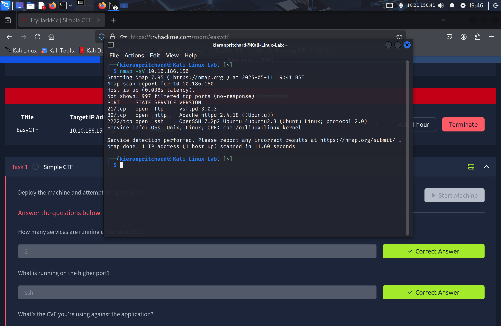
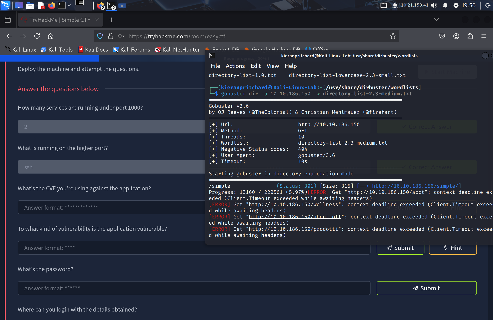
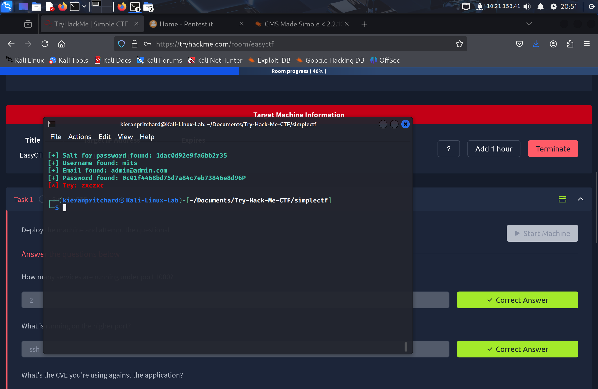
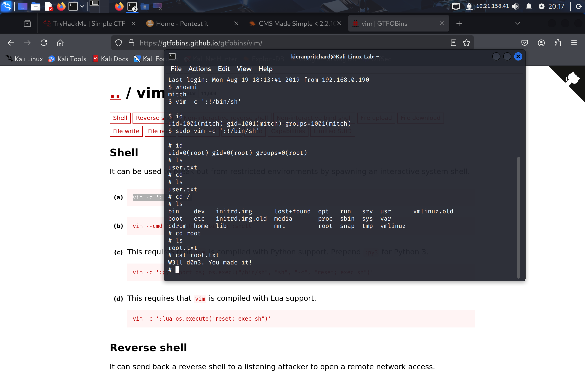

# 📌 Challenge Info

- **CTF Name: Try Hack Me**
- **Challenge Name: Simple CTF**
- **Category: Web App**
- **Points: 300**
- **Difficulty: Easy**

# 🧠 Challenge Description

Beginner level ctf

# 🗃️ Files Provided

None other then the machine

# 🌐 Challenge Setup

## **Tools Used:**

- **nmap** — For network reconnaissance and port scanning
- **gobuster** — To brute-force web directories
- **exploit-db** — To search for known vulnerabilities
- **Python 3** — For running the modified exploit
- **SSH** — To remotely access the target machine
- **gtfobins** — To find privilege escalation techniques

## **Environment:**

- Kali linux virtual machine

# 🔍 Initial Recon

I first scanned for services and open ports on the IP address with nmap. i then found three services on the network: port 21 uses FTP; port 80 uses HTTP (meaning there is a website); and port 2222 uses SSH to allow for remote sign on. I followed this up with gobuster to see what web pages I can access. I found a page called simple, I found this using a wordlist called: “directory-list-2-3-medium-txt”.

# 🛠️ Exploitation / Solution

## 1. Exploitation

- the path lead me to a page called “cms made simple”.
- i investigated the site for any noticeable things i could search for in exploit database. Then i found a version number in the footer.
- I then searched for it in exploit database and found an sql injection exploitation.
- I downloaded it and found it was written in python 2, so to save time i had google gemini convert it to the current python version python 3.
- I used the exploit and gained the users details being the username: “mitch” and the password: secret

## 2. Post exploitation

- I used the found credentials to log onto the machine using ssh.
- I used the whoami command to identify my user, i then used the find command to locate the user flag.
- i then found and submitted the flag
- used ls to see the users in the home directory and found a user called sunbath.

## 3. Privilege Escalation

- Used the find command to search for files i could use to escalate to admin.
- listed sudo apps and found vim required the admin user.
- I then went on gtfoblins and found a vim payload.
- gained sudo privileges and found root file flag and completed challenge

# 🏴 Flag

```
W3ll d0n3. You made it!
```

# 🧪 Tools Used

- **nmap** — Port scanning and service enumeration
- **gobuster** — Directory brute-forcing
- **Exploit-DB** — Finding public exploits
- **Python 3** — Running the exploit
- **SSH** — Remote shell access
- **gtfobins** — Privilege escalation techniques

# 📝 Notes / Lessons Learned

- Always check for version info in footers — it’s often an easy path to exploitation.
- Don’t ignore non-standard SSH ports (e.g., 2222).
- Converting old Python exploits is a useful skill — Python 2 is increasingly outdated.
- GTFOBins is invaluable for privilege escalation — bookmark it!

# 📷 Screenshots








